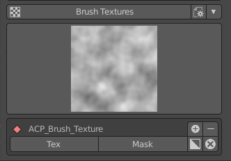

主介面總覽
##########

專案資料夾面板
**************
專案資料夾用來存放由ACPainter產生的各項資料，例如：Blender檔案、圖層貼圖等等。

.. image:: images/Project_folder.png
   :alt: Project_folder.png
   :align: center

材質面板
********
材質瀏覽器用來檢視所選物體的材質狀態，擁有可以增加材質、刪除材質、複製材質等等功能。

圖層通道面板
************
圖層通道面板有兩種模式：直線模式與自由模式。直線模式可以經由選擇的材質節點與輸入通道，直接使用圖層通道的功能。
自由模式則適合更進階的使用者，建議更熟悉ACPainter後使用，需要自行連接材質節點使用，但是應用變化更多。

圖層面板
********
圖層面板顯示圖層通道內的圖層排列狀態，並且在這個面板可以執行相當多的功能，諸如新增、刪除圖層，繪畫色彩模式切換、相機投影功能等等。

畫筆面板
********
畫筆面板顯示了紋理繪畫時最需要的畫筆功能，改良了必要資訊的顯示方式，訊息顯示更直覺，操作區域更集中、使用更快速； 畫筆面板並且提供了十多組方便使用的畫筆設定，
支援載入、輸出Gimp色票檔案(.gpl)，隨時得到想用的調色盤。

影像瀏覽器
**********
影像瀏覽器顯示了Blender檔案中的所有影像，可以直接對影像作相對應的操作，例如：增加影像、刪除影像等等，更重要的是，影像瀏覽器可以連動所選圖層的影像，隨時掌握影像的變化。

紋理瀏覽器
**********
影像瀏覽器顯示了Blender檔案中的所有紋理，可以直接對紋理作相對應的操作，例如：增加紋理、刪除紋理、反相紋理等等

