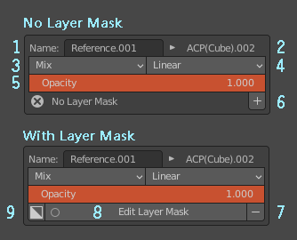
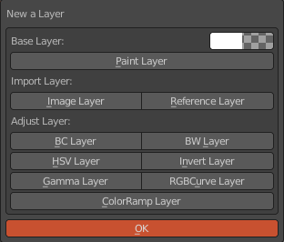
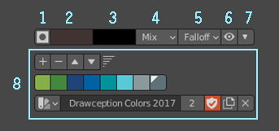
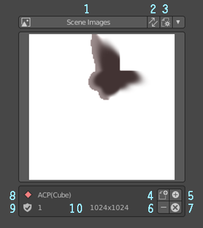
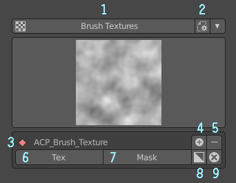

=============================
介面詳細解說
=============================

專案資料夾面板
**************************************************************************************

* 1. 專案資料夾路徑。
 
.. note:: 如果路徑不是絕對路徑而引起相關操作錯誤，將路徑改為絕對路徑即可。
 
* 2. 專案資料夾選擇鈕。絕對路徑與相對路徑可在其中修改，按住Alt點擊可用檔案總管開啟選定的資料夾。
 
.. image:: images/Project_folder_detail.png
   :alt: Project_folder.png
   :align: center
 
次級面板 
---------------------------------------------------------------------------------------
* *修改相對路徑為絕對路徑*

.. image:: images/Project_folder_relative_path.png 
   :alt: Project_folder_relative_path.png
   :width: 400px
   :align: center
 
材質面板
**************************************************************************************
* 1. 將3D視窗顯示設定為ACPainter材質環境。
* 2. ACPainter存檔功能，存檔時會將未存檔的影像一起儲存。如果檔案已經存檔，則按原名覆蓋存檔，如果沒有存檔過，則存檔為"ACP(Save)-日期"名稱。
* 3. ACPainter另存新檔功能，存檔時會將未存檔的影像一起儲存。儲存一個檔案，名稱為"ACP(Save)-日期"名稱。
 
.. note:: 存檔功能需要設定好專案資料夾才能正常運作。
 
* 4. 材質3D視窗中的顯示方式。有Opaque、Alph Clip、Alpha Hashed、Alpha Blend四種顯示方式。
* 5. 增加材質。
* 6. 刪除材質。
* 7. 複製材質。
* 8. 打開材質編輯器。
* 9. 材質列表欄。

圖層通道面板
**************************************************************************************
* 1. 直線模式(可切換為自由模式)。直接將圖層通道連接於指定的材質節點位置上。
* 2. 選擇材質中ACPainter有支援的材質節點。
* 3. 選擇材質節點中ACPainter有支援的輸入通道。
* 4. 材質節點與輸入通道的過濾選項。
* 5. 圖層通道名稱(可更改)。
* 6. 刪除圖層通道。
* 7. 自由模式(可切換為直線模式)。於材質中產生圖層通道節點，須自行連接使用。
* 8. 圖層通道列表。
* 9. 增加圖層通道。
* 10. 刪除圖層通道。
* 11. 清理圖層通道資料。圖層通道資料不正常時，可以清除多餘無用的相關資訊。
* 12. 在材質編輯器中選擇指定的圖層通道節點。

次級面板 
---------------------------------------------------------------------------------------
* *新增圖層通道*
 
.. image:: images/Layerchannel_add.png 
   :alt: Layerchannel_add.png
   :align: center 

圖層面板
**************************************************************************************
* 1. 增加圖層。
* 2. 刪除圖層。
* 3. 圖層往上。
* 4. 圖層往下。
* 5. 圖層設定選項面板。
* 6. 打開影像編輯器。
 
* a. 單圖層繪畫模式。
* b. Blender預設影像混色模式。
* c. Photoshop風格影像混色模式。
* d. 攝影機投影--抓圖(至外部2D編輯軟體開啟)。
* e. 攝影機投影--投影(從外部2D編輯軟體導入)。
* f. 攝影機自投影(抓圖後直接再投射至模型上)。
* g. UV-Mesh展開(會複製原模型)。將所選的3D模型展開為UV的平面佈局。
* h. 切換3D模型與UV的平面佈局。
* i. 將可視的圖層在Compositor中合成(不支援調整圖層)。
* j. 輸出可視圖層至專案資料夾中。如果所有圖層都設為不可視，則會輸出物件的UV-Layout影像。
 
.. note:: 輸出圖檔功能需要設定好專案資料夾才能正常運作。
 
* k. 攝影機六方向全景投影。
 

 
* 1. 圖層名稱(可更改)。
* 2. 圖層對應的影像名稱。
 
.. warning:: 請不要手動修改圖層對應的影像名稱，會引起操作錯誤。
 
* 3. 圖層混色模式。
* 4. 縮放圖層影像演算方法。
* 5. 圖層不透明度。
* 6. 圖層增加遮罩。
* 7. 圖層刪除遮罩。
* 8. 編輯圖層遮罩。
* 9. 反相圖層遮罩。
 

 
次級面板 
---------------------------------------------------------------------------------------
* *新增圖層*
   * 1. PaintLayer：繪畫圖層，初始可以設定顏色與不透明度。
   * 2. ImageLayer：影像圖層，從外部影像導入Blender，導入後不再與原文件連結，可再繼續繪圖修改。
   * 3. ReferenceLayer：參考圖層，從外部影像導入Blender，導入後繼續與原文件連結，不可繪圖修改，但可隨原文件更新。
   * 4. BCLayer：調整圖層，調整圖層影像明度、對比度。
   * 5. BWLayer：調整圖層，將圖層影像轉為灰階影像。
   * 6. HSVLayer：調整圖層，調整圖層影像色相、飽和度、明度。
   * 7. InvertLayer：調整圖層，將圖層影像反相。
   * 8. GammaLayer：調整圖層，調整圖層影像Gamma值。
   * 9. RGBCurveLayer：調整圖層，調整圖層影像RGB值曲線。
   * 10. ColorRampLayer：調整圖層，調整圖層影像漸層對應效果。
 
    
    更詳細使用方法請參閱圖層章節
 

 
* *圖層設定選項面板*
   * 1. Layer Info：輸出影像圖層是否攜帶影像資訊，圖層順序編號、混合方式、不透明度。
   * 2. Sort Inverse：輸出影像圖層排序方法，啟用時，最下方圖層為第一層圖層，反之，最上方圖層為第一層圖層。
   * 3. Project Image Scale：攝影機投影時抓圖大小，值越大越清晰，但是速度越慢。
   * 4. Scale Object：攝影機六方向全景投影時，縮放所選物件。
   * 5. Use Orthgraphic View to Project：攝影機六方向全景投影時，使用無透視正交視角。
   * 6. Hide Active Object in Viewport：攝影機六方向全景投影時，隱藏所選物件。
   * 7. Width：圖層通道影像寬度值。
   * 8. Height：圖層通道影像高度值。
 
    
    更詳細使用方法請參閱圖層與攝影機投影章節
 
.. image:: images/Layer_Option.png
   :alt: Layer_Option.png
   :align: center
 
畫筆面板
**************************************************************************************
* 1. 畫筆Icon設定鈕。
* 2. 畫筆設定選項鈕。
* 3. 載入ACPainter畫筆。
* 4. 載入.gpl檔案色票。
* 5. 輸出.gpl檔案色票。
* 6. 畫筆Texture顯示鈕。畫筆有使用Texture會高亮顯示。
* 7. 畫筆Texture設定選項鈕。
* 8. 畫筆Texture Mask顯示鈕。畫筆有使用Texture Mask會高亮顯示。
* 9. 畫筆Texture Mask設定選項鈕。
* 10. 切換畫筆為Draw Brush。
* 11. 切換畫筆為Fill Brush。
* 12. 切換畫筆為Soften Brush。
* 13. 切換畫筆為Smear Brush。
* 14. 切換畫筆為Clone Brush。
 

 
* 1. 畫筆鎖定圖層Alpha繪畫。
* 2. 畫筆前景色。
* 3. 畫筆背景色。
* 4. 畫筆混色模式。
* 5. 畫筆強度衰減模式。
* 6. 顯示畫筆強度衰減模式。
* 7. 色票收納按鈕。
* 8. 色票控制選項，同Blender預設。
 

影像瀏覽器
**************************************************************************************
* 1. 顯示當前圖層影像。
* 2. 同步圖層影像。
* 3. 影像預覽圖大小調整。
* 4. 將所選影像轉換成一個新繪畫圖層。
* 5. 從外部新增影像。
* 6. 刪除影像。如果影像在任何圖層中使用則不會刪除。
* 7. 刪除所有沒使用者的影像。
* 8. 影像名稱。
* 9. 使用者數量。
* 10. 影像尺寸。
 

 

紋理瀏覽器
**************************************************************************************
* 1. 將屬性面板轉到紋理分頁。
* 2. 紋理預覽圖大小調整。
* 3. 反相2D紋理。
* 4. 從外部新增紋理。
* 5. 刪除紋理。
* 6. 刪除所有沒使用者的紋理。

