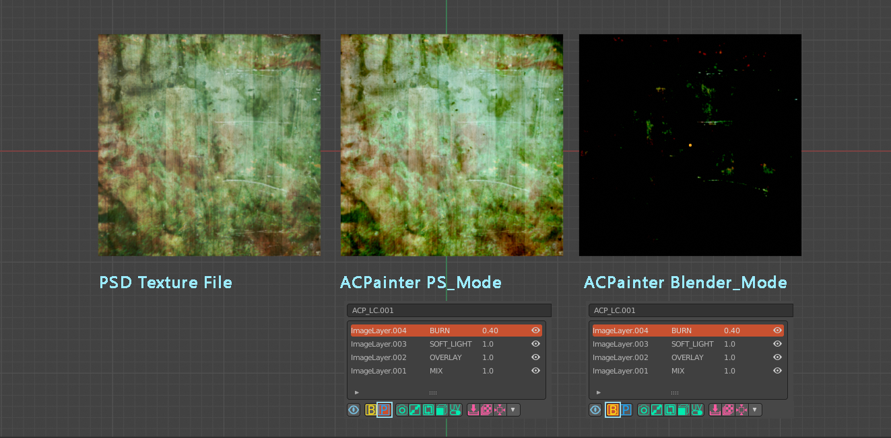
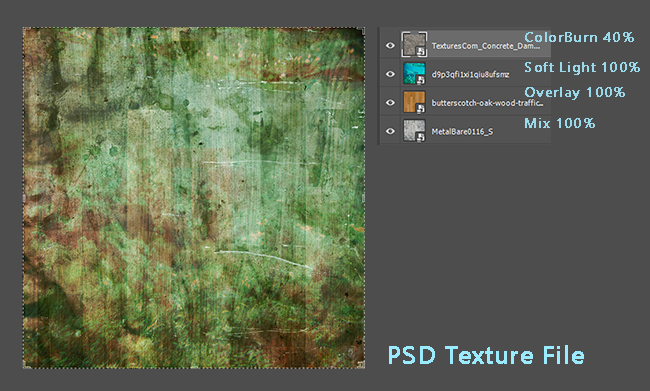

混色模式
========

混色模式的比較
--------------------

如果您常使用Blender來做3D模型紋理繪製，您會發現Blender的影像混合效果並不像Photoshop或是Krita中色彩呈現的效果，這樣的不一致成為了在Blender中紋理繪製
的最大痛苦，因為同樣的色彩影像，在不同的軟體中成色卻有很大的不同，在Photoshop與Krita，同樣的圖層與混色效果比Blender中預設的效果更為色彩繽紛、也更為
有細節層次。
 
ACPainter試圖去減低這樣的不一致，唯有降低了Blender與2D繪圖軟體的混色差異，才讓ACPainter的圖層系統能有與其他2D繪圖軟體溝通
的可能性。
 
以下為ACPainter使用不同色彩模式模擬同樣圖層混合效果的PSD檔案。
 

 

 
兩種色彩空間混色模式
--------------------
    ACPainter提供了新的混色模式，稱之為PS_Mode，主要就是模擬PSD檔案的混色效果，而另一種則是Blender預設的混色效果，稱之為Blender_Mode，在ACPainter
    中可以隨時切換兩種模式，並且不同的圖層通道可以套用不同的混色效果，方便搭配使用。
 
.. image:: images/BlendMode_UI.png
   :alt: BlendMode_UI.png
   :align: center
 
取色方法
--------
* Blender_Mode
 
    Blender預設混色方法，可在影像編輯器(ImageEditor)與3D視窗(3DViewport)中用取色器取得期望中的顏色。
 
* PS_Mode
 
    ACPainter提供的PS_Mode混色模式，會將圖像轉換至不同色彩空間，所以在影像編輯器(ImageEditor)中取色器將無法取得期望中的顏色，只有從3D視窗(3DViewport)
    才能取得期望中的顏色。
 
    為此，ACPainter提供了一個將3D視窗(3DViewport)變為類似影像編輯器(ImageEditor)的方法。
     1. 使用ACPainter提供的UV_Mesh功能，將3D模型轉變為UV的佈局。
     2. 可搭配UV_Mesh切換功能，隨時將UV的佈局再變回3D模型。
     3. 在3D視窗(3DViewport)中自由繪畫、取色吧！
 

 
.. image:: images/BlendMode_PS_mode_paint.png
   :alt: BlendMode_PS_mode_paint.png
   :align: center
   
   

